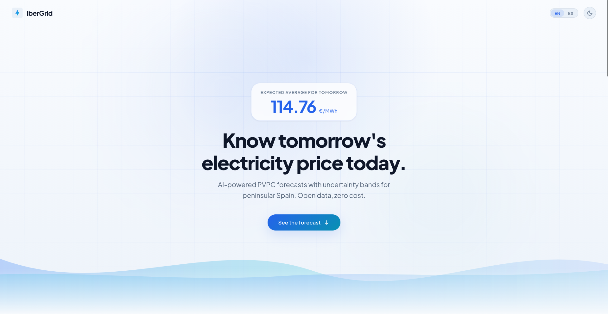
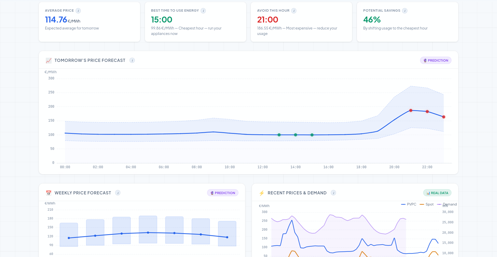
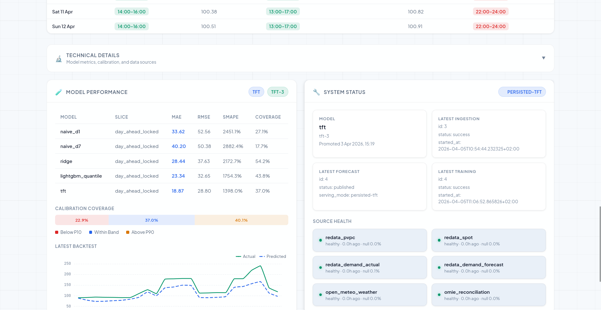

# IberGrid

IberGrid is a web platform for forecasting PVPC electricity prices in peninsular Spain.

It shows:

- next-day hourly forecast
- weekly outlook
- market context
- model performance
- source status

## Screenshots







## Technologies

- Python 3.12
- FastAPI
- Next.js
- PostgreSQL
- MLflow
- PyTorch Forecasting
- Docker Compose

## Project structure

```text
apps/
  api/      FastAPI backend
  web/      Next.js frontend
  worker/   scheduled jobs
packages/
  ml/       data processing and model training
docs/
  deployment.md
```

## Data sources

- REData
- OMIE
- Open-Meteo

## Quick start with Docker

The easiest way to run the project locally is with Docker:

```bash
docker compose up --build
```

Services:

- web: `http://localhost:3000`
- api: `http://localhost:8000`
- mlflow: `http://localhost:5000`
- postgres: `localhost:5432`

## Local installation

### Python

```bash
python3.12 -m venv .venv
source .venv/bin/activate
python -m pip install -U pip
python -m pip install -e '.[dev]'
python -m pip install --index-url https://pypi.org/simple --extra-index-url https://download.pytorch.org/whl/cpu \
  torch==2.7.1+cpu lightning==2.5.6 pytorch-forecasting==1.5.0
```

### Frontend

```bash
npm install
npm --workspace apps/web run dev
```

## Common commands

```bash
make refresh
make backfill
make train
make publish
make reconcile
make api
make web
make worker
make test
```

## Basic usage

Recommended order:

```bash
make backfill
make train
make publish
```

Then open:

- frontend: `http://localhost:3000`
- API docs: `http://localhost:8000/docs`

## Main API routes

- `GET /health`
- `GET /ready`
- `GET /api/v1/forecast/day-ahead?date=YYYY-MM-DD`
- `GET /api/v1/forecast/week-ahead?from=YYYY-MM-DD`
- `GET /api/v1/context/market?from=...&to=...`
- `GET /api/v1/model/performance/latest`
- `GET /api/v1/status/latest`
